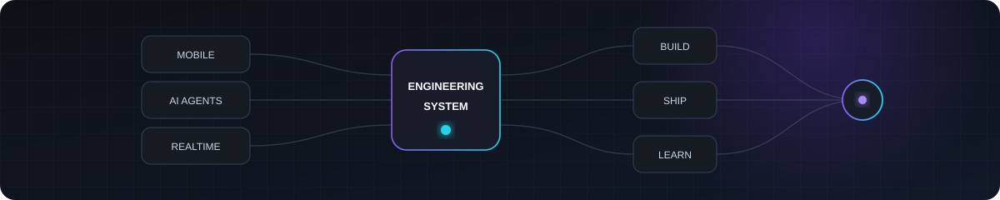

<h1 align="center">Ryosuke Shimizu</h1>

  <strong>Mobile Engineering · AI Agents · Realtime Systems</strong> 
  Android Tech Lead at <a href="https://avvy.live/en"><strong>AnotherBall</strong></a> · Tokyo, Japan

  I build mobile products and engineering systems where humans and AI agents work together.

  <a href="https://app.notion.com/p/rio432/Android-1c047dd696d6806fa200f7db09a64166">Resume</a>
  · <a href="https://speakerdeck.com/rio432">Talks</a>
  · <a href="./CAREER.md">Career</a>
  · <a href="https://x.com/rioX432">X</a>

<picture>
  <source media="(prefers-color-scheme: dark)" srcset="./assets/profile-systems-dark.svg">
  <source media="(prefers-color-scheme: light)" srcset="./assets/profile-systems-light.svg">
  
</picture>

## Now

### Building Avvy

Leading Android development while working across Kotlin Multiplatform, realtime media, face tracking, and cross-platform product engineering.

### Building with AI agents

Designing development environments where agents can investigate, plan, implement, review, and verify software across multiple projects — not just generate code.

### Exploring realtime & graphics systems

Experimenting with GPU UI, realtime rendering, interactive character systems, and ways to make advanced visual experiences easier to build across platforms.

## Selected Work

### [agent-witness](https://github.com/rioX432/agent-witness)

**Observability and auditing for AI coding agents.**

A Rust tool that records agent sessions and makes delegation, tool usage, token usage, and potentially destructive operations inspectable.

`Rust` · `Claude Code` · `MCP` · `Agent Observability`

### [CivitDeck](https://github.com/rioX432/CivitDeck)

**A native workspace for discovering and running generative AI models.**

A Kotlin Multiplatform application spanning Android, iOS, and Desktop, integrating Civitai, ComfyUI, local generation workflows, and on-device search.

`Kotlin Multiplatform` · `Compose` · `SwiftUI` · `ONNX` · `Core ML`

### [ai-dev-templates](https://github.com/rioX432/ai-dev-templates)

**Structured workflows and guardrails for agent-driven software development.**

Reusable patterns for investigation, decomposition, implementation, verification, review, and PR workflows with context-isolated agents and automated quality gates.

`AI Agents` · `Automation` · `Verification`

## Current R&D

A large part of my recent experimental work happens in private repositories.

### Agentic Engineering

I'm building a development environment where a single request can be turned into an execution plan, delegated across specialized coding agents, independently reviewed, verified, and applied across multiple local projects.

My focus is not just code generation, but the surrounding system: **context, memory, orchestration, review, observability, and verification**.

### Interactive & GPU Systems

I'm researching cross-platform approaches to advanced UI and motion: shared visual contracts, native GPU rendering, generated motion components, and automated visual evaluation across Android, Apple platforms, Web, and other runtimes.

The goal is to preserve native-level visual quality while making complex interactive systems more reusable and easier to develop with AI agents.

### Realtime Characters

I'm exploring realtime character experiences that combine face tracking, realtime communication, rendering, game-engine integration, and interactive effects.

This extends my production work with **MediaPipe, ARKit, RTC, Unity, Kotlin Multiplatform, and avatar systems**.

## Talks

### DroidKaigi 2026

**[Overcoming accuracy limits of MediaPipe Face Landmarker](https://speakerdeck.com/rio432/overcoming-accuracy-limits-of-mediapipe-face-landmarker)**

A production-driven talk about improving face-tracking accuracy beyond the raw output of MediaPipe Face Landmarker.

[Session](https://2026.droidkaigi.jp/timetable/1236039/) · [Slides](https://speakerdeck.com/rio432/overcoming-accuracy-limits-of-mediapipe-face-landmarker) · [Video](https://www.youtube.com/watch?v=S79Mc9332bU)

### iOSDC Japan 2026 — Rookies LT

**Why is “puffing out your cheeks” detected so accurately? / 「ほっぺを膨らませる」が高精度なのはなぜ？**

A five-minute lightning talk about why facial-expression tracking can behave differently across iOS and Android.

[iOSDC Japan 2026](https://iosdc.jp/2026/) · [Speaker Deck](https://speakerdeck.com/rio432)

## Engineering

**Mobile**  
Kotlin · Swift · Android · iOS · Jetpack Compose · SwiftUI · Kotlin Multiplatform

**AI Engineering**  
Claude Code · Codex · MCP · Agent orchestration · Subagents · Evaluation · Verification

**Realtime & Graphics**  
MediaPipe · ARKit · RTC · Camera / Audio · Unity · GPU rendering

**Backend & Cloud**  
Kotlin · Spring Boot · Firebase · REST APIs

## Background

8+ years building mobile products across **Topcon → LY Corporation → AnotherBall**, with additional hands-on experience in iOS, backend systems, and technical leadership.

See [CAREER.md](./CAREER.md) for the full career history.
